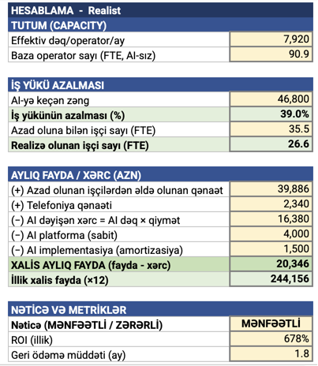

# Call Center AI Business Case

## Analiz haqqında

Aylıq **120,000 zəngdən** yaranan operator iş yükü və əməliyyat xərclərinin AI vasitəsilə azaldılması qiymətləndirilib. Pessimist, realist və optimist ssenarilər müqayisə olunub.

## Realist ssenarinin nəticəsi

* AI-yə ötürülən zənglər: **46,800**
* İş yükünün azalması: **39%**
* Realizə olunan FTE qənaəti: **26.6**
* Xalis aylıq fayda: **20,346 AZN**
* Yekun qiymətləndirmə: **Mənfəətli**

## Analizin görünüşü

## Fayllar

* [İnteraktiv modeli aç](https://docs.google.com/spreadsheets/d/1GB4fukYxZQ1f7sWiT2pOoza5KaAzwR2Hv6CwofCF72I/edit?gid=1978403608#gid=1978403608)
* [PDF-də bax](Call_Center_AI_Business_Case.pdf)

## Bacarıqlar

`Business Case` · `Scenario Analysis` · `Cost–Benefit Analysis` · `Financial Modeling` · `Decision Support`

